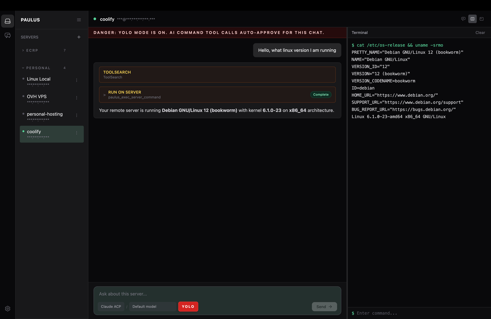

<div align="center">


# Paulus Orchestrator

A centralized server management app for macOS, Linux, and Windows. Organize your servers, connect over SSH, and run work through a built-in terminal or an AI chat — all from one local-first desktop app.

[](https://github.com/pauliusdotpro/paulus-orchestrator/actions/workflows/ci.yml)
[](https://github.com/pauliusdotpro/paulus-orchestrator/actions/workflows/release.yml)
[](LICENSE)
[](https://github.com/pauliusdotpro/paulus-orchestrator/stargazers)

</div>

## About

Paulus Orchestrator is a desktop connection manager for people who run servers. If you live in `~/.ssh/config` files, juggle bastion hosts, or wish your SSH workflow looked more like a real app and less like a stack of terminal tabs, this is for you.

Think of it as an open-source, local-first take on tools like Royal TSX, Termius, or Royal TS — with one extra trick: every server has its own AI chat, so you can describe a task in plain English, review the proposed shell command, approve it, and watch it run.

- **Your servers, in one place.** Hosts, ports, users, tags, auth methods — all organized in a sidebar instead of scattered across config files.
- **Local-first.** Server configs and credentials never leave your machine. Passwords are encrypted with the OS keychain via Electron `safeStorage`.
- **Cross-platform.** Native builds for macOS, Linux, and Windows.
- **AI-assisted, not AI-controlled.** Nothing runs without your explicit approval.

## Screenshot



## Features

### Server management

- Centralized library of SSH servers with host, port, username, tags
- Password and private-key authentication
- Encrypted credential storage in the OS keychain (macOS Keychain, Windows DPAPI, libsecret)
- Connection pooling — one SSH session is shared across the terminal, file ops, and AI tools
- Per-server connection state, kept reactive in the UI

### Terminal

- Built-in xterm.js terminal with live `stdout` / `stderr`
- Multiple per-server sessions
- Real-time output, no polling

### AI chat (optional)

- Per-server chat tied to that server's connection
- Multi-server chats — talk to a fleet, route commands per host
- Backed by your local Claude Code or Codex CLI install (no API keys live in the app)
- Tool-calling over an internal MCP server: `paulus_exec_server_command`, `paulus_get_server_context`
- Every shell command goes through an approval gate before it runs

### Privacy & data

- Server configs: `{userData}/data/servers.json`
- Settings: `{userData}/data/settings.json`
- Credentials: encrypted, in `{userData}/data/credentials.json`
- All writes are atomic (`.tmp` + rename)
- No telemetry, no cloud account, no sign-in

## How it compares

|                                          | Paulus Orchestrator | Royal TSX / TS | Termius   | Plain `~/.ssh/config` |
| ---------------------------------------- | ------------------- | -------------- | --------- | --------------------- |
| Open source                              | ✅                  | ❌             | ❌        | ✅                    |
| Local-first (no cloud account)           | ✅                  | ✅             | ❌ (sync) | ✅                    |
| OS keychain credential storage           | ✅                  | ✅             | ✅        | ❌                    |
| Built-in terminal                        | ✅                  | ✅             | ✅        | ❌                    |
| AI chat per server, with approval gate   | ✅                  | ❌             | partial   | ❌                    |
| Cross-platform (macOS / Linux / Windows) | ✅                  | macOS / Win    | ✅        | ✅                    |
| Free                                     | ✅                  | freemium       | freemium  | ✅                    |

## Installation

Download the latest signed build from the [releases page](https://github.com/pauliusdotpro/paulus-orchestrator/releases).

- macOS: `.dmg` (Apple-notarized)
- Windows: `.exe`
- Linux: `.AppImage`

### Build from source

Requirements:

- [Bun](https://bun.sh)
- Node.js `24.x`

```bash
git clone https://github.com/pauliusdotpro/paulus-orchestrator.git
cd paulus-orchestrator
bun install
bun run dev
```

## How it works

1. Add a server (host, port, user, password or key).
2. Open the terminal or the chat tab.
3. In the terminal, work as you normally would.
4. In the chat, describe the task in plain English.
5. Paulus proposes a shell command — you review it.
6. Approve, and Paulus runs it on the connected server and shows the output.

## Development

```bash
bun run dev          # Electron dev app
bun run build        # production renderer + main bundle
bun run build:dist   # packaged installer for current OS
bun run typecheck
bun run format
bun run check        # format:check + typecheck
```

### Debugging Electron

In development the app exposes Chrome DevTools Protocol on port `9222`.

1. Run `bun run dev`
2. Open `chrome://inspect`
3. Add `localhost:9222`
4. Inspect the Electron renderer target

## Architecture

Bun workspaces monorepo.

```text
apps/
  cli        # headless harness for the AI providers
  desktop    # Electron app (the product)
  web        # placeholder for a future web frontend

packages/
  ai         # AI provider abstraction (Claude ACP, Codex ACP) + internal MCP server
  bridge     # UI ⇄ backend bridge interface (Electron IPC today, web tomorrow)
  core       # SSH connection pool, server manager, session manager
  shared     # types, constants, version
  ui         # React components, Zustand stores, shared styles
```

The renderer talks through a `Bridge` interface. Today it's wired to Electron IPC; the same UI can later talk to a web backend without rewriting the app layer.

## Tech stack

- Bun workspaces
- Electron 41 + electron-vite 5
- React 19, Zustand, Tailwind CSS v4
- `ssh2` for SSH transport, with connection pooling in the main process
- `safeStorage` for OS-keychain credential encryption
- TypeScript end-to-end

## Contributing

```bash
git checkout -b codex/my-change
bun run check
```

Open a pull request when the branch is ready. Issues are triaged regularly — small, focused PRs land fastest.

## Repo activity


## Star history

[](https://star-history.com/#pauliusdotpro/paulus-orchestrator&Date)

## License

[MIT](LICENSE)
